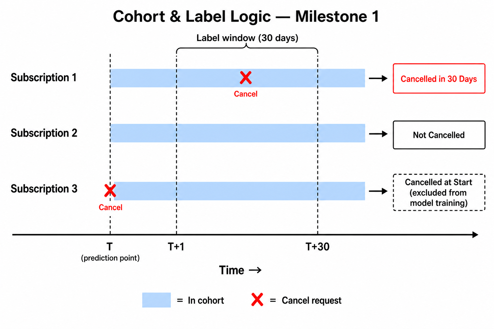

# ED Subs Key Definitions

## Business

**Active subscriber:** a user with an Rx written and a successful subscription payment.

> Example: if a provider writes the Rx and a user is successfully charged, the user is active.

**Period:** one paid billing cycle. A period can be 1, 3, or 6 months long.

> Example: if a user starts an ED subscription on 7/1 and ends on 12/31 on a 3-month cadence, the term includes two periods: 7/1–9/30 and 10/1–12/31.

**Subscription term:** the continuous paid period of access. A term can include one or more consecutive periods.

> Example: if a user starts a 3-month ED subscription on 7/1 and remains subscribed until 12/31, then 7/1–12/31 is one continuous subscription term, made up of two 3-month periods.

**Cancellation request:** the subscriber asks to cancel the subscription. The subscription remains active through the already-paid term.

> Example: if a user cancels on April 10 but the current term ends on May 31, the subscription stays active until June 1.

**Undo cancellation:** a subscriber reverses a prior cancellation request before it takes effect. Available starting from May 2026.

> Example: if a user submits a cancellation request on June 10 and reverses it on June 20 before the term ends, that is an undo cancellation.

---

## Modeling (Milestone 1)

**Qualified subscription terms**: 

- The **first terms** of subscriptions
    - Why exclude reactivated terms?
    
        Reactivation is recent product change and the **sample size is limited**. Including   them    - would mix different product states and make the sample less clean.

- were **activated**, and

- **started before June 1, 2026**

    - Why require terms to start before June 1, 2026?

        This ensures every included term has a full 30-day observation window. It also ensures the  churn outcome is fully observable as of today.

**Preidction target**: cancellation in the next 30 days

- Why cancellation instead of effective churn?

    This analysis focuses on pre-churn behavior in the pre-reactivation product era, when   **cancellation almost certainly led to churn**. Therefore, the prediction target should be cancellation so that **action can be taken in time**.

**Prediction point (T): Features are frozen at T (all data up to and including T is used).

**Label window:** T+1, T+30 — the 30 days **after** T, excluding T itself.

> Same-day cancellations (`cancel_requested_at = term_started_at::date`) are tracked separately as `cancelled_at_start` in the label table and excluded from model training (they are already-decided before the model could act).



**Voluntary churn:** churn driven by an explicit user cancellation request (`cancel_requested_at IS NOT NULL`).

**Involuntary churn:** churn driven by payment failure (`is_failed_payment_canceled = TRUE` at the term level). Included in EDA but excluded from model training — not driven by user intent and not actionable by a prevention model.

**Reactivation:** a new `subscription_term_id` created under the same `subscription_id` after a churn. Not in scope for Milestone 1 — reactivation only became available after June 2026 and data is sparse. Churn is treated as irreversible for this milestone.

**Deferred renewal:** a subscriber pushes their next renewal date to a later date (`event_name = 'term_renewal_time_changed' AND changed_by = 'CHANGED_BY_USER'` in `int_subs_kafka__events`).

**Production use:** the model scores all active subscriptions at any point in time and predicts:

> "Will this subscriber request cancellation in the next 30 days?"

This is actionable — we can intervene before the cancellation request is submitted.

---

## Rolling window modeling approaches (Milestone 1)

Two rolling window approaches will be tested:

### Approach A — Forward rolling window

Starting from each subscription's `term_started_at`, roll forward in 30-day steps until June 2026. Each step creates one training observation:

```
Observation 1: snapshot = term_started_at,          label window = [+0, +30 days]
Observation 2: snapshot = term_started_at + 30,     label window = [+30, +60 days]
Observation 3: snapshot = term_started_at + 60,     label window = [+60, +90 days]
...until snapshot >= 2026-06-01 or term ends
```

- **Label**: did `cancel_requested_at` fall within the label window? → `is_cancelled` 0/1
- **Features**: all features computed as of the prediction point (no future data)
- Applies to both churners and non-churners symmetrically

### Approach B — Backward from cancellation

For churned subscribers only, starting from `cancel_requested_at`, roll backward in 30-day steps until `term_started_at`:

```
Observation 1 (label=1): snapshot = cancel_requested_at - 30,   label window = [snapshot, +30 days]
Observation 2 (label=0): snapshot = cancel_requested_at - 60,   label window = [snapshot, +30 days]
Observation 3 (label=0): snapshot = cancel_requested_at - 90,   label window = [snapshot, +30 days]
...until snapshot <= term_started_at
```

- **For non-churners**: apply the same backward stepping from `term_active_until` or data pull date
- **Features**: all features computed as of each prediction point
- Ensures every churn event is captured with exactly one label=1 row at 30 days before cancellation

### Comparison


|                            | Forward                | Backward                       |
| -------------------------- | ---------------------- | ------------------------------ |
| Anchor point               | term_started_at        | cancel_requested_at (churners) |
| Non-churner anchor         | Same (term_started_at) | Needs separate definition      |
| Mirrors production scoring | Yes                    | Partially                      |
| Implementation             | Straightforward        | More complex for non-churners  |


Both approaches will be implemented and evaluated. The better-performing one will be used for the final model.

---

## Implementation notes

- `Ask kevin: term_ended_at` is only populated when a subscription is already cancelled/terminated. For active subscriptions, use `term_active_until` for the expected end date.